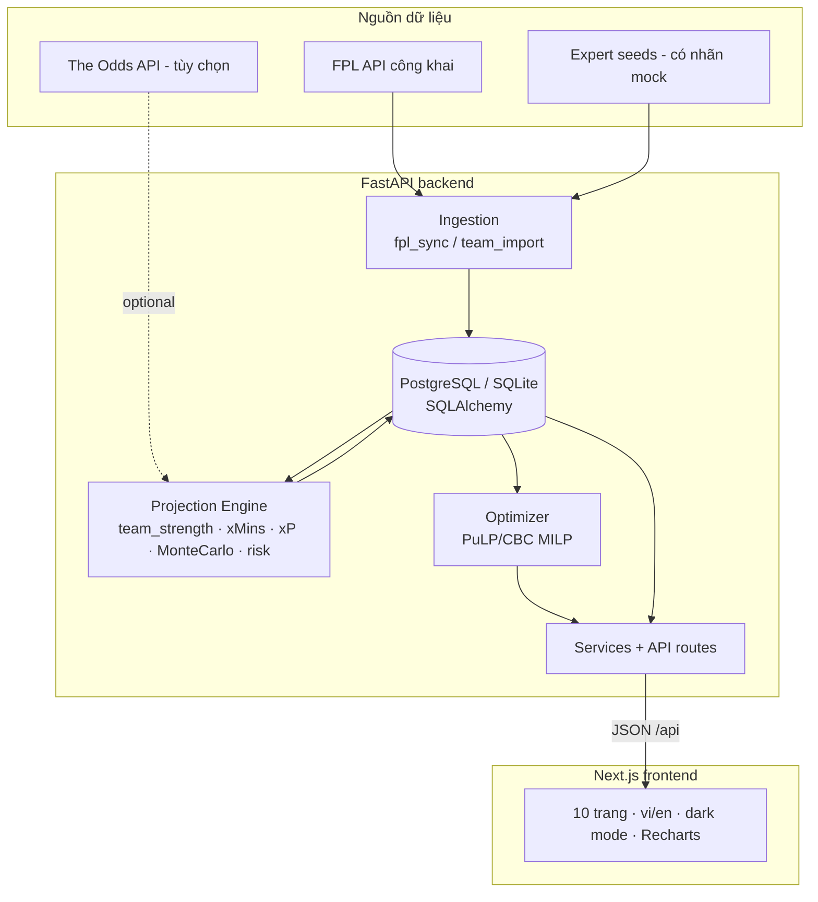
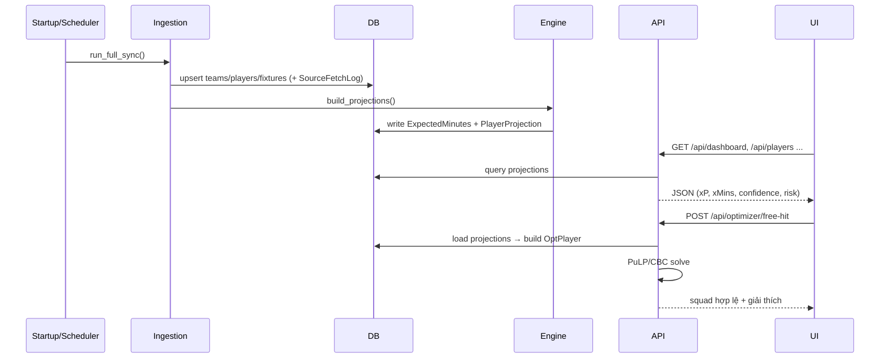
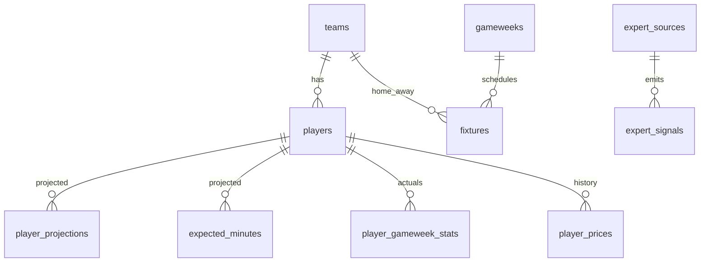

# Kiến trúc — FPL Edge VN

## 1. Tổng thể



## 2. Luồng dữ liệu



## 3. Cấu trúc thư mục

```
fpl-planner/
├── backend/
│   ├── app/
│   │   ├── config.py          # settings (env-driven, không hard-code key)
│   │   ├── db.py              # SQLAlchemy engine/session, init_db()
│   │   ├── cache.py           # Redis hoặc in-memory TTL
│   │   ├── scoring.py         # luật tính điểm mùa hiện tại (configurable)
│   │   ├── models/            # ORM: core, projections, meta
│   │   ├── schemas/           # Pydantic request models
│   │   ├── providers/         # fpl_client, probability, expert_provider
│   │   ├── ingestion/         # fpl_sync, team_import
│   │   ├── engine/            # team_strength, xmins, xpoints, montecarlo,
│   │   │                      #   fixture_difficulty, risk, projections
│   │   ├── optimizer/         # constraints, squad, transfer (next+long-term)
│   │   ├── services/          # players, fixtures, captains, news, team, gameweek
│   │   ├── api/routes/        # health, catalog, optimizer_routes
│   │   ├── seed_demo.py       # dữ liệu offline có nhãn mock
│   │   ├── cli.py             # sync / project / seed-demo
│   │   └── main.py            # FastAPI app + lifespan + CORS
│   ├── alembic/               # migration (baseline create_all)
│   └── tests/                 # pytest: constraints, optimizer, engine, api
└── frontend/
    ├── app/                   # App Router: 10 trang + layout + providers
    ├── components/            # nav, pitch, fpl (cards/badges), ui primitives
    └── lib/                   # api, i18n, format, utils
```

## 4. Database schema (chính)



Bảng đầy đủ (spec §20): `seasons, gameweeks, teams, players, player_prices,
fixtures, player_gameweek_stats, player_projections, expected_minutes,
model_versions, injury_reports, set_piece_roles, expert_sources, expert_signals,
source_fetch_logs, user_profiles, optimization_runs`.

Mỗi `player_projections` gắn với `model_version` + `data_cutoff` + `gameweek`
để truy vết (spec: projection phải liên kết model version & cutoff time).

## 5. Nguyên tắc thiết kế

- **Zero-config dev:** SQLite + cache in-memory, không cần Postgres/Redis để chạy thử.
- **Scale-up prod:** cùng codebase chạy Postgres + Redis qua biến môi trường.
- **Provider abstraction:** khi chưa có API tỷ lệ, dùng model nội bộ và gắn nhãn `model_estimate`.
- **Truy vết & minh bạch:** mọi số liệu có nguồn + thời điểm; trang Methodology công khai.
